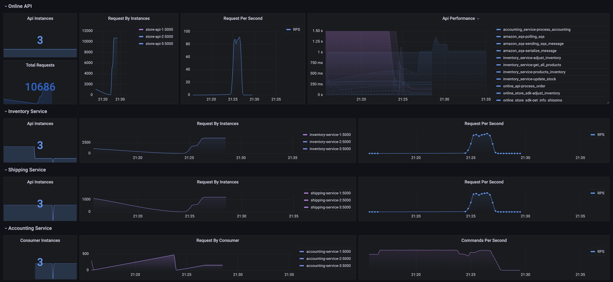
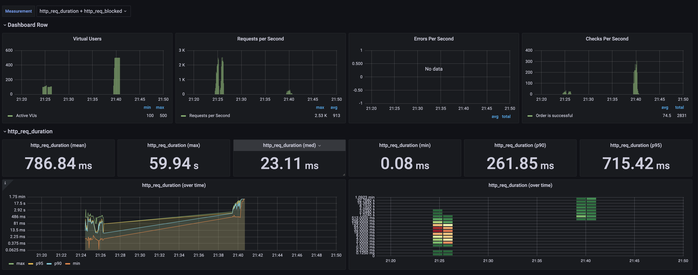
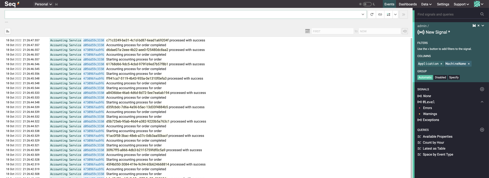

# online-store-vnext
[](https://github.com/fazleyKholil/online-store/actions/workflows/docker-compose-build.yml)

Demo online store demonstrating an optimisation from a monolith application https://github.com/fazleyKholil/online-store to a scalable architecture

# Application Structure


## Running locally

When running in docker, all components use port 5000 internal to the container, and are exposed at ports from 5000 upwards:
For demo purposes, 3 instances of the application will be running for each service and is accessible on individual endpoints.
To load balance between the apps, use the load balancer port.

|Component   | Exposed Port  | Load Balancer Port  |  Load balancer Url |Description |
|---|---|---|---|---|
|store-api-{1,2,3} | 5001,5003,5003 |5050 | http://localhost:5050/_system/health |The shop api|
| inventory-service-{1,2,3} | 5101,5102,5103 |5051 | http://localhost:5051/_system/health |Inventory micro service|
| shipping-service-{1,2,3} | 7001,7002,7003 |5052 | http://localhost:5052/_system/health |Shipping Micro service|
| accounting-service-{1,2,3} | 8001,8002,8003 |NA | http://localhost:8001/_system/health |Through Load balancer|
| Prometheus | 9090 |NA | http://localhost:9090 |Scrapping application metrics|
| Grafana | 9090 |NA |http://localhost:3001 |Metrics Dashboards / Observability|

### Running locally commands
To bring up the infrastructure and the services, the `docker-compose` command can be executed in the below order:

```
 docker-compose -f docker-compose.infra.yml up --build --force-recreate -d  
 docker-compose -f docker-compose.app.yml up --build --force-recreate -d   
 docker-compose -f docker-compose.loadbalancer.yml up --build --force-recreate -d
```

Use this command to check if all the services is up and running
```bash
Fazley.Kholil@MAC online-store-vnext % docker ps
CONTAINER ID   IMAGE                                     COMMAND                  CREATED             STATUS             PORTS                                                                                                      NAMES
c4b8eeea0671   online-store-vnext_nginx-api              "/docker-entrypoint.…"   About an hour ago   Up About an hour   0.0.0.0:5050->80/tcp, :::5050->80/tcp                                                                      online-store-vnext_nginx-api_1
89dfd2b15360   online-store-vnext_nginx-inventory        "/docker-entrypoint.…"   About an hour ago   Up About an hour   0.0.0.0:5051->80/tcp, :::5051->80/tcp                                                                      online-store-vnext_nginx-inventory_1
6318dc12cbfb   online-store-vnext_nginx-shipping         "/docker-entrypoint.…"   About an hour ago   Up About an hour   0.0.0.0:5052->80/tcp, :::5052->80/tcp                                                                      online-store-vnext_nginx-shipping_1
9a1b3bab4cb6   online-store-vnext_accounting-service-2   "dotnet Accounting.S…"   About an hour ago   Up About an hour   0.0.0.0:8002->5000/tcp, :::8002->5000/tcp                                                                  accounting-service-2
5c05c36b1d71   online-store-vnext_inventory-service-3    "dotnet Inventory.Se…"   About an hour ago   Up About an hour   0.0.0.0:5103->5000/tcp, :::5103->5000/tcp                                                                  inventory-service-3
7914d5f3629a   online-store-vnext_shipping-service-2     "dotnet Shipping.Ser…"   About an hour ago   Up About an hour   0.0.0.0:7002->5000/tcp, :::7002->5000/tcp                                                                  shipping-service-2
047177db9cfb   online-store-vnext_accounting-service-3   "dotnet Accounting.S…"   About an hour ago   Up About an hour   0.0.0.0:8003->5000/tcp, :::8003->5000/tcp                                                                  accounting-service-3
47027d95adbe   online-store-vnext_shipping-service-3     "dotnet Shipping.Ser…"   About an hour ago   Up About an hour   0.0.0.0:7003->5000/tcp, :::7003->5000/tcp                                                                  shipping-service-3
ffa0aef56d23   online-store-vnext_inventory-service-2    "dotnet Inventory.Se…"   About an hour ago   Up About an hour   0.0.0.0:5102->5000/tcp, :::5102->5000/tcp                                                                  inventory-service-2
306a65e2eef5   online-store-vnext_store-api-3            "dotnet Online.Store…"   About an hour ago   Up About an hour   0.0.0.0:5003->5000/tcp, :::5003->5000/tcp                                                                  store-api-3
f6b58def171d   online-store-vnext_shipping-service-1     "dotnet Shipping.Ser…"   About an hour ago   Up About an hour   0.0.0.0:7001->5000/tcp, :::7001->5000/tcp                                                                  shipping-service-1
8f39ed3256e2   online-store-vnext_store-api-2            "dotnet Online.Store…"   About an hour ago   Up About an hour   0.0.0.0:5002->5000/tcp, :::5002->5000/tcp                                                                  store-api-2
687c2e82d871   online-store-vnext_store-api-1            "dotnet Online.Store…"   About an hour ago   Up About an hour   0.0.0.0:5001->5000/tcp, :::5001->5000/tcp                                                                  store-api-1
fe74276d2e19   online-store-vnext_accounting-service-1   "dotnet Accounting.S…"   About an hour ago   Up About an hour   0.0.0.0:8001->5000/tcp, :::8001->5000/tcp                                                                  accounting-service-1
c09f95088807   online-store-vnext_inventory-service-1    "dotnet Inventory.Se…"   About an hour ago   Up About an hour   0.0.0.0:5101->5000/tcp, :::5101->5000/tcp                                                                  inventory-service-1
2cd8c845e617   online-store-vnext_nginx                  "/docker-entrypoint.…"   3 hours ago         Up 3 hours         0.0.0.0:5005->80/tcp, :::5005->80/tcp                                                                      online-store-vnext_nginx_1
3bdfaf59f109   online-store-vnext_grafana                "/run.sh"                3 hours ago         Up 3 hours         0.0.0.0:3001->3000/tcp, :::3001->3000/tcp                                                                  grafana
dec8a8844012   online-store-vnext_prometheus             "/bin/prometheus --c…"   3 hours ago         Up 3 hours         0.0.0.0:9090->9090/tcp, :::9090->9090/tcp                                                                  prometheus
b34751e85ad8   localstack/localstack:0.11.2              "docker-entrypoint.sh"   3 hours ago         Up 3 hours         0.0.0.0:4563-4599->4563-4599/tcp, :::4563-4599->4563-4599/tcp, 0.0.0.0:8080->8080/tcp, :::8080->8080/tcp   localstack
4204794d1de7   influxdb:1.8                              "/entrypoint.sh infl…"   3 hours ago         Up 3 hours         0.0.0.0:8086->8086/tcp, :::8086->8086/tcp                                                                  online-store-vnext_influxdb_1
bf747f912ac0   datalust/seq:latest                       "/run.sh"                3 hours ago         Up 3 hours         5341/tcp, 0.0.0.0:5341->80/tcp, :::5341->80/tcp                                                            seq
```

### Sample Request
[](https://app.getpostman.com/run-collection/c7dd6db7c8a44749b2a2?action=collection%2Fimport)
```
curl --location --request POST 'http://localhost:5050/OnlineStore/order' \
--header 'Content-Type: application/json' \
--data-raw '{
    "products": [
        {
            "productId": "0acc81de-de63-45b5-864a-dd6637a75ca4",
            "quantity": 2
        }
    ],
    "isShippingExpress": true,
    "shippingDistance": 100
}'
```


### Monitoring

We use [Prometheus](https://prometheus.io/) and [Grafana](https://grafana.com/) for instrumentation, monitoring and analytics.

The application exposes an endpoint at `/_system/metrics-text` containing aggregated metrics built with the help of [Prometheus](https://prometheus.io/).

You can find a docker compose file (`docker-compose.yml`) that will start both prometheus and grafana along with provisioned dashboards.


Prometheus will be accessible at http://localhost:9090/

Grafana will be accessible at http://localhost:3001/ (username: admin, password: admin).
To be able to view the dashboard, create a prometheus datasource named *prometheus* and the provisioned dashboard will result as below.



### Running Load Test Locally
```
docker-compose -f docker-compose.loadtests.yml up --build
```

Expected results on terminal :
```
Fazley.Kholil@MAC-C02C96SNMD6M online-store-vnext % docker-compose -f docker-compose.loadtests.yml up --build
WARNING: Found orphan containers (shipping-service-3, online-store-vnext_nginx-api_1, localstack-config, seq, prometheus, grafana, online-store-vnext_nginx-shipping_1, store-api-3, online-store-vnext_influxdb_1, accounting-service-2, localstack, online-store-vnext_nginx_1, store-api-2, accounting-service-3, inventory-service-2, accounting-service-1, store-api-1, inventory-service-1, inventory-service-3, online-store-vnext_nginx-inventory_1, shipping-service-2, shipping-service-1) for this project. If you removed or renamed this service in your compose file, you can run this command with the --remove-orphans flag to clean it up.
Building k6
[+] Building 0.2s (8/8) FINISHED                                                                                                                                                                                                                            
 => [internal] load build definition from Dockerfile                                                                                                                                                                                                   0.0s
 => => transferring dockerfile: 37B                                                                                                                                                                                                                    0.0s
 => [internal] load .dockerignore                                                                                                                                                                                                                      0.0s
 => => transferring context: 2B                                                                                                                                                                                                                        0.0s
 => [internal] load metadata for docker.io/loadimpact/k6:latest                                                                                                                                                                                        0.0s
 => [1/3] FROM docker.io/loadimpact/k6                                                                                                                                                                                                                 0.0s
 => [internal] load build context                                                                                                                                                                                                                      0.0s
 => => transferring context: 224B                                                                                                                                                                                                                      0.0s
 => CACHED [2/3] COPY ./scripts/ /                                                                                                                                                                                                                     0.0s
 => CACHED [3/3] COPY ./test-cycles/ /                                                                                                                                                                                                                 0.0s
 => exporting to image                                                                                                                                                                                                                                 0.0s
 => => exporting layers                                                                                                                                                                                                                                0.0s
 => => writing image sha256:f5bdf3c570ca5eefa1cc342634f5a3b19895837111b21462eac20073054bde56                                                                                                                                                           0.0s
 => => naming to docker.io/library/k6                                                                                                                                                                                                                  0.0s

Use 'docker scan' to run Snyk tests against images to find vulnerabilities and learn how to fix them
Starting k6 ... done
Attaching to k6
k6    | 
k6    |           /\      |‾‾| /‾‾/   /‾‾/   
k6    |      /\  /  \     |  |/  /   /  /    
k6    |     /  \/    \    |     (   /   ‾‾\  
k6    |    /          \   |  |\  \ |  (‾)  | 
k6    |   / __________ \  |__| \__\ \_____/ .io
k6    | 
k6    |   execution: local
k6    |      script: /load-test-script.js
k6    |      output: influxdb (http://influxdb:8086)
k6    | 
k6    |   scenarios: (100.00%) 1 scenario, 500 max VUs, 1m20s max duration (incl. graceful stop):
k6    |            * loadTest: Up to 500.00 iterations/s for 50s over 4 stages (maxVUs: 100-500, gracefulStop: 30s)
k6    | 
k6    | 
k6    | running (0m00.9s), 100/100 VUs, 7 complete and 0 interrupted iterations
k6    | loadTest   [   2% ] 050/100 VUs  00.9s/50s  064 iters/s
...
k6    | 
k6    | running (0m05.9s), 188/188 VUs, 149 complete and 0 interrupted iterations
k6    | loadTest   [  12% ] 185/188 VUs  05.9s/50s  084 iters/s
...
...
...
k6    |      █ Create a new order
k6    | 
k6    |        ✗ Order is successful
k6    |         ↳  92% — ✓ 2459 / ✗ 196
k6    | 
k6    |      checks.........................: 92.61% ✓ 2459  ✗ 196  
k6    |      data_received..................: 873 kB 11 kB/s
k6    |      data_sent......................: 736 kB 9.2 kB/s
k6    |      dropped_iterations.............: 13693  171.281001/s
k6    |      group_duration.................: avg=9.77s    min=402.38ms med=1.62s   max=1m0s     p(90)=35.56s   p(95)=1m0s    
k6    |      http_req_blocked...............: avg=1.48ms   min=16.8µs   med=24.7µs  max=116.28ms p(90)=1.34ms   p(95)=8.19ms  
k6    |      http_req_connecting............: avg=1.04ms   min=0s       med=0s      max=81.54ms  p(90)=599.43µs p(95)=5.6ms   
k6    |    ✗ http_req_duration..............: avg=9.76s    min=401.83ms med=1.62s   max=59.93s   p(90)=35.51s   p(95)=59.93s  
k6    |        { expected_response:true }...: avg=5.76s    min=401.83ms med=1.55s   max=58.62s   p(90)=16.55s   p(95)=32.31s  
k6    |    ✗ http_req_failed................: 7.38%  ✓ 196   ✗ 2459 
k6    |      http_req_receiving.............: avg=317.68µs min=0s       med=149.8µs max=43.03ms  p(90)=387.97µs p(95)=607.69µs
k6    |      http_req_sending...............: avg=507.69µs min=25µs     med=69.9µs  max=55.82ms  p(90)=322.61µs p(95)=1.15ms  
k6    |      http_req_tls_handshaking.......: avg=0s       min=0s       med=0s      max=0s       p(90)=0s       p(95)=0s      
k6    |      http_req_waiting...............: avg=9.76s    min=401.54ms med=1.62s   max=59.93s   p(90)=35.51s   p(95)=59.92s  
k6    |      http_reqs......................: 2655   33.210477/s
k6    |      iteration_duration.............: avg=9.77s    min=402.45ms med=1.62s   max=1m0s     p(90)=35.56s   p(95)=1m0s    
k6    |      iterations.....................: 2655   33.210477/s
k6    |      orderErrors....................: 196    2.451696/s
k6    |      tpsCounter.....................: 2655   33.210477/s
k6    |      vus............................: 500    min=100 max=500
k6    |      vus_max........................: 500    min=100 max=500
k6    | 
k6    | time="2022-10-18T17:40:47Z" level=error msg="some thresholds have failed"
k6 exited with code 99
Fazley.Kholil@MAC-C02C96SNMD6M online-store-vnext % 
```

Expected result on Grafana :



### Logging

We use [Seq](https://datalust.co/seq) for logging.
Seq will be accessible at http://localhost:5341/


